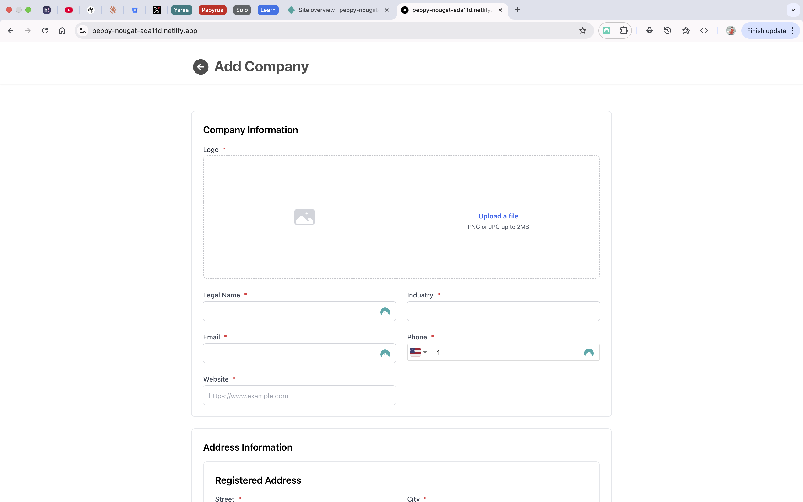

# Company Management System

**Assignment Version Number: FE-2024-12-i**

A modern web application for managing company information, contacts, and employee data with a clean, user-friendly interface.


## Features

- Secure login with authentication
- Create and manage detailed company profiles
- Track company contact information and addresses
- Manage primary contact persons for each company
- Store company details including industry, employee counts, and incorporation information
- Upload and manage company logos
- Add social media links and website information
- Validate phone numbers and other contact information
- Responsive design that works on desktop and mobile devices
- Form validation with helpful error messages
- Clean, modern UI with intuitive navigation

## Demo

A live demo of the application is available at: [https://peppy-nougat-ada11d.netlify.app/login](https://peppy-nougat-ada11d.netlify.app/login)

## Screenshots

### Login Page


### Company List


### Add Company Page


### Edit Company Page


## Technology Stack

- **Next.js** - React framework for server-side rendering and routing
- **TypeScript** - For type-safe code
- **Formik** - For form management and validation
- **Yup** - For schema validation
- **Tailwind CSS** - For styling components
- **libphonenumber-js** - For phone number validation
- **GraphQL** - For API communication
- **Apollo Client** - For GraphQL state management

## Installation and Setup

### Prerequisites

- Node.js (v16 or higher)
- npm (v8 or higher) or yarn

### Installation Steps

1. Clone the repository
   ```
   git clone https://github.com/yourusername/company-management-elite-software.git
   cd company-management-elite-software
   ```

2. Install dependencies
   ```
   npm install
   # or with yarn
   yarn install
   ```

3. Create a `.env.local` file in the root directory and add your environment variables
   ```
   NEXT_PUBLIC_API_URL=your_api_url_here
   NEXT_PUBLIC_USERNAME=your_user_name
   NEXT_PUBLIC_PASSWORD=your_password
   ```

4. Start the development server
   ```
   npm run dev
   # or with yarn
   yarn dev
   ```

5. The application will open in your default browser at `http://localhost:3000`

## Usage Guide

### Login

- Access the application through the login page
- Enter your username and password to authenticate
- The system will validate your credentials and redirect you to the dashboard upon successful login

### Dashboard

- The dashboard displays a list of companies in the system
- Use the search functionality to find specific companies
- Click on any company to view detailed information
- Use the "Add Company" button to create a new company profile

### Company Form

- The company form allows you to create or edit company information
- All required fields are marked with an asterisk (*)
- Phone numbers are automatically validated for correct format
- Upload a company logo by clicking on the logo upload area
- Toggle the "Mailing address is different from registered address" option to add a separate mailing address
- Submit the form to save the company information

### Company Details

- The details page shows comprehensive information about the company
- View contact information, addresses, and employee counts
- See the primary contact person's details
- Use the back button to return to the dashboard

## Project Structure

The application is organized into the following structure:

```
app/
├── login/                 
│   ├── login_form.component.tsx            # Login form component
│   └── page.tsx                            # Login page
├── (company)/                 
│   ├── company_form.component.tsx          # Company form component
│   └── page.tsx                            # Company add/edit page
├── companies/                  
│   ├── company_list.component.tsx          # Company list component
│   └── page.tsx                            # Company list page
_components/                                # Reusable UI components
├── auth_check.component.tsx                # Authentication check
├── form_phone_number_input.component.tsx   # Phone input component
├── form_text_input.component.tsx           # Text input component
└── spinner.component.tsx                   # Loading indicator
_hooks/                                     # Custom React hooks
├── use_create_company.hook.ts              # Hook for creating new company records
├── use_get_company.hook.ts                 # Hook for fecthing a single company
├── use_get_signed_download.hook.ts         # Hook for fecthing a signed download url
└── use_is_valid_session.hook.ts            # Session validation hook
_stores/                                    # State management
└── app.store.ts                            # Zustand store for city data
├── layout.tsx                              # Main application layout
```

## Form Components

The application includes several reusable form components:

- **FormTextInput**: A standard text input component with validation
- **FormPhoneNumberInput**: A custom input for phone numbers with international format validation
- **FormSelect**: A dropdown select component for options like countries or industries

## Phone Number Validation

The application uses libphonenumber-js for robust phone number validation:

- International format support with country code detection
- Validation against known phone number patterns
- Error messages for invalid phone numbers
- Automatic formatting of valid numbers

## Building for Production

To build the application for production:

```
npm run build
# or with yarn
yarn build
```

The built files will be in the `.next` directory.

To start the production server:

```
npm run start
# or with yarn
yarn start
```

## Assignment Information

This project was completed as Task 2 of the Frontend Software Engineer practical test assignment (Version Number: FE-2024-12-i) for Elite Software Automation.
